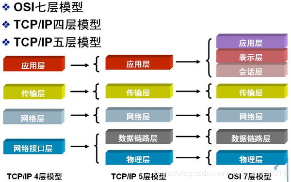

# TCP/IP分为几层？各层的作用是什么?

## 1. 应用层 2.传输层 3.网络层 4.网络接口层*

## 应用层
TCP/IP协议族在这一层面有着很多协议来支持不同的应用，许多大家所熟悉的基于Internet的应用的实现就离不开这些协议。如我们进行万维网（WWW）访问用到了HTTP协议、文件传输用FTP协议、电子邮件发送用SMTP、域名的解析用DNS协议、远程登录用Telnet协议等等，都是属于TCP/IP应用层的；就用户而言，看到的是由一个个软件所构筑的大多为图形化的操作界面，而实际后台运行的便是上述协议。（FTP、SMTP、telnet、DNS、tftp）

## 传输层
这一层的的功能主要是提供应用程序间的通信，TCP/IP协议族在这一层的协议有TCP和UDP。（UDP）

## 网络层
是TCP/IP协议族中非常关键的一层，主要定义了IP地址格式，从而能够使得不同应用类型的数据在Internet上通畅地传输，IP协议就是一个网络层协议。（IP数据包）

## 网络接口层
这是TCP/IP软件的最低层，负责接收IP数据包并通过网络发送之，或者从网络上接收物理帧，抽出IP数据报，交给IP层。(帧，网络接口协议)
