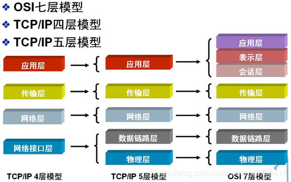

# TCP/IP分为几层？各层的作用是什么?

## 1. 应用层 2.传输层 3.网络层 4.网络接口层*

## 应用层
TCP/IP协议族在这一层面有着很多协议来支持不同的应用，许多大家所熟悉的基于Internet的应用的实现就离不开这些协议。如我们进行万维网（WWW）访问用到了HTTP协议、文件传输用FTP协议、电子邮件发送用SMTP、域名的解析用DNS协议、远程登录用Telnet协议等等，都是属于TCP/IP应用层的；就用户而言，看到的是由一个个软件所构筑的大多为图形化的操作界面，而实际后台运行的便是上述协议。（FTP、SMTP、telnet、DNS、tftp）

## 传输层
这一层的的功能主要是提供应用程序间的通信，TCP/IP协议族在这一层的协议有TCP和UDP。（UDP）

## 网络层
是TCP/IP协议族中非常关键的一层，主要定义了IP地址格式，从而能够使得不同应用类型的数据在Internet上通畅地传输，IP协议就是一个网络层协议。（IP数据包）

## 网络接口层
这是TCP/IP软件的最低层，负责接收IP数据包并通过网络发送之，或者从网络上接收物理帧，抽出IP数据报，交给IP层。(帧，网络接口协议)

# 网络知识

## [Ajax](Ajax.md)

## [HTTP](HTTP.md)

## [TCP](TCP.md)

## [UDP](UDP.md)

## [跨域](./跨域.md)

## [缓存](缓存.md)

## [cookie和session](cookie和session.md)

## [从输入URL到页面加载完成的过程](从输入URL到页面加载完成的过程.md)

## [HTTPS](HTTPS.md)

### OSI 七层协议
 - 应用层
   - 为应用提供通信服务
 - 表示层
   - 定义数据格式以及加密
 - 会话层
   - 定义了如何开始、控制、结束一个会话，包括对多个双向消息的控制和管理。
 - 传输层
   - 选择差错恢复协议还是无差错恢复协议
   - TCP、UDP
 - 网络层
   - 端到端包传输。
   - 路由选择、包分解成更小的包
 - 数据链路层
   - 定义单个链路上如何传输数据
 - 物理层
   - 传输介质相关

### TCP/IP四层模型
  - 数据链路层
  - 网络层
  - 传输层
  - 应用层

### DNS解析
DNS 的作用就是通过域名查询到具体的 IP。

1. 操作系统会首先在本地缓存中查询
2. 没有的话会去系统配置的 DNS 服务器中查询
3. 如果这时候还没得话，会直接去 DNS 根服务器查询，这一步查询会找出负责 com 这个一级域名的服务器
4. 然后去该服务器查询 google 这个二级域名
5. 接下来三级域名的查询其实是我们配置的，你可以给 www 这个域名配置一个 IP，然后还可以给别的三级域名配置一个 IP

以上介绍的是 DNS 迭代查询，还有种是递归查询，区别就是前者是由客户端去做请求，后者是由系统配置的 DNS 服务器做请求，得到结果后将数据返回给客户端。

### 前后端如何通信
 - Ajax
 - WebSocket
 - CORS

### websocket
在单个 TCP 连接上进行全双工通讯的协议。在 WebSocket API 中，浏览器和服务器只需要完成一次握手，两者之间就直接可以创建**持久性**的连接，并进行**双向**数据传输。

 - Socket.onopen	连接建立时触发
 - Socket.onmessage	客户端接收服务端数据时触发
 - Socket.onerror	通信发生错误时触发
 - Socket.onclose	连接关闭时触发
